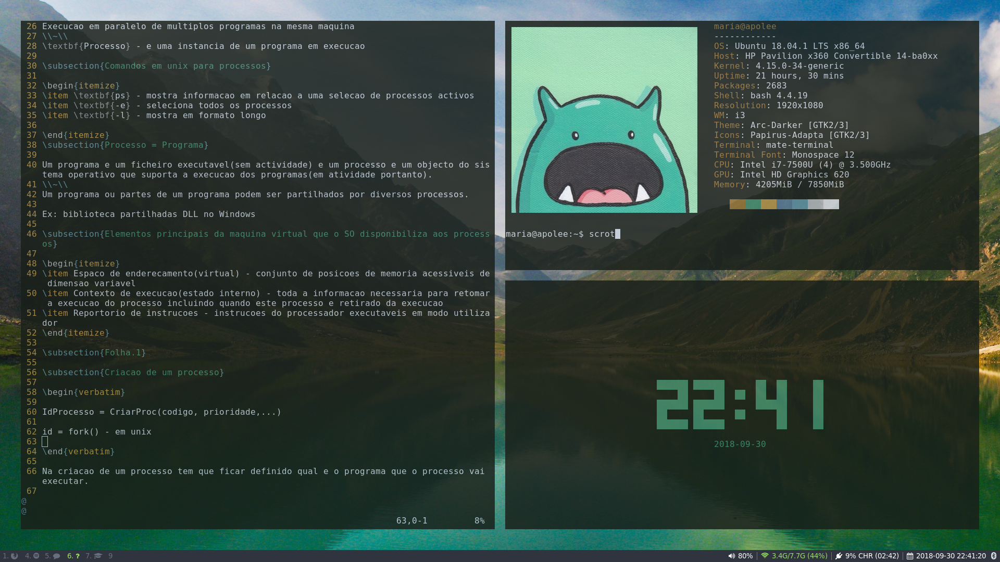

# i3-dotfiles
Dotfiles for my i3 configuration.

## Dependencies
- Window-manager: [i3-gaps](https://github.com/Airblader/i3)
- Notifications: [dunst](https://launchpad.net/ubuntu/+source/dunst)
- Status bar: [i3blocks](https://github.com/vivien/i3blocks)
- Launcher: [rofi](https://github.com/DaveDavenport/rofi)
- Terminal : [mate-terminal](https://github.com/mate-desktop/mate-terminal)
- Color scheme: [pywal](https://github.com/dylanaraps/pywal)
- Font/Icons for everything except terminal: [System San Francisco](https://github.com/supermarin/YosemiteSanFranciscoFont) 
- To enable media keys (sound): [playerctl](https://github.com/acrisci/playerctl)
- To enable media keys (brightness): [light](https://github.com/haikarainen/light) 
- To enable opacity: [compton](https://aur.archlinux.org/packages/compton/)
- Clock widget: [tty-clock](https://github.com/xorg62/tty-clock)
- Command line system information tool: [neofetch](https://github.com/dylanaraps/neofetch)
- [Wallpaper](https://www.wallpaperflare.com/white-moon-night-minimalism-sky-power-lines-wallpaper-203381)
